# R56doc Architecture and Workplan

## 1. Product direction

R56doc is a browser-only public diagnostic product for the MINI R56.

The final public flow should be:

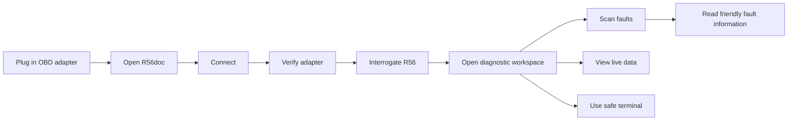

The product should expose the technical side through a terminal, while presenting the actual diagnostic meaning in plain English for users who care about cars but are not diagnostic-tool experts.

---

## 2. Final page structure

Public pages:

```text
index.html
    connection and setup

cmd.html
    complete diagnostic workspace
```

Development-only pages may remain temporarily:

```text
faults.html
fault-self-test.html
```

Faults and live data should eventually be integrated into `cmd.html`.

---

## 3. Main `cmd.html` layout

### Initial viewport

The first screen should be approximately 50/50:

```text
┌──────────────────────────────┬───────────────────────────────┐
│                              │                               │
│       COMMAND TERMINAL       │       KEY INFORMATION         │
│                              │                               │
│  > ATI                       │  MINI R56 Cooper S            │
│  STN2255 ...                 │  Engine: N14                  │
│                              │  Transmission: Manual         │
│  [Scan Faults]               │                               │
│                              │  Vehicle Connected            │
│                              │  ECUs detected                │
│                              │  Fault count                  │
│                              │  Battery                      │
│                              │  Coolant                      │
│                              │  RPM                          │
└──────────────────────────────┴───────────────────────────────┘
```

The right-hand side should focus on what matters immediately:

- vehicle identity;
- adapter/vehicle connection state;
- number of responding ECUs;
- current fault count;
- current/historic fault summary;
- battery voltage;
- coolant temperature;
- RPM;
- vehicle speed;
- boost/MAP where relevant.

### Scroll behaviour

Once the user scrolls beyond the opening cockpit, the terminal should animate into a side dock.

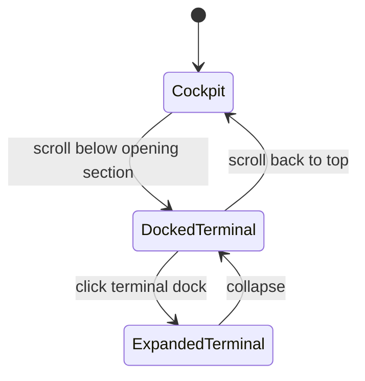

The terminal must remain the same DOM element so its history, input and state are preserved.

---

## 4. Scrollable diagnostic sections

After the initial cockpit:

```text
VEHICLE HEALTH
    identity
    connection
    ECU status
    health summary

FAULTS
    current faults
    historic faults
    plain-English descriptions
    likely causes where verified
    severity where verified
    scan timestamp
    ECU occurrence data where verified

ENGINE
    RPM
    coolant
    intake temperature
    oil temperature
    boost / MAP
    throttle
    accelerator
    ignition timing
    fuel pressure
    lambda / O2
    fuel trims
    fan state
    diesel DPF data where applicable

CHASSIS
    four wheel speeds
    steering angle
    brake pressure
    yaw rate
    lateral acceleration
    longitudinal acceleration
    clutch state
    gear
    vehicle speed

ELECTRICAL
    battery/system voltage
    ignition state
    useful electrical/module state data
```

Live data is therefore part of the main page rather than a separate `live-data.html`.

---

## 5. Overall architecture

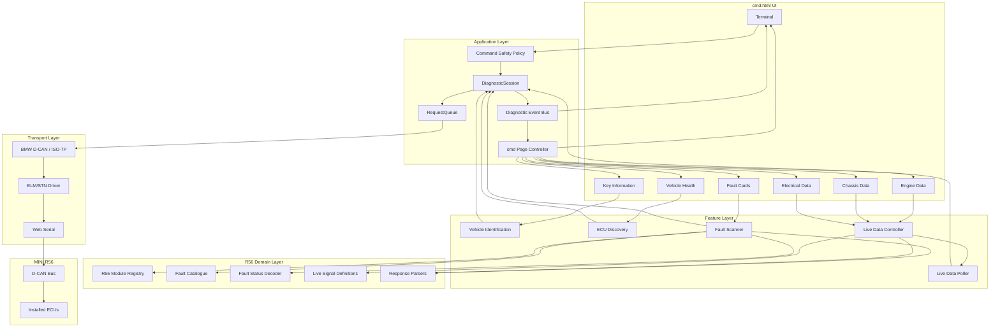

---

## 6. Most important technical rule: one request at a time

Terminal commands, fault scanning, vehicle identification and live polling must never independently read/write the serial stream.

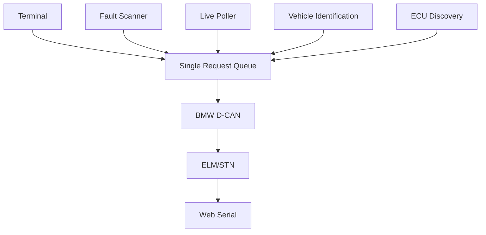

Recommended priority:

```text
1. future guarded write/safety operation
2. user terminal command
3. fault scan
4. vehicle identification / ECU discovery
5. live-data polling
```

Live polling should yield whenever a higher-priority operation is waiting.

---

## 7. `DiagnosticSession`

Add:

```text
js/diagnostics/diagnostic-session.js
```

Suggested API:

```js
class DiagnosticSession {
    async initialise()

    async executeAdapterCommand(command)
    async executeDiagnosticRead(module, payload)

    async identifyVehicle()
    async discoverModules()
    async scanFaults()

    async startLivePolling()
    async stopLivePolling()

    async shutdown()
}
```

The page controller should talk to `DiagnosticSession`, not directly to `Elm327` or `BmwDcan`.

---

## 8. Request queue

Add:

```text
js/diagnostics/request-queue.js
```

Responsibilities:

- one active diagnostic request at a time;
- queue later requests;
- priority handling;
- timeouts;
- pause/resume live polling;
- request lifecycle events;
- no simultaneous serial readers/writers.

---

## 9. Diagnostic event bus

Add:

```text
js/diagnostics/diagnostic-events.js
```

Example events:

```js
{ type: "tx", module: "DSC", canId: "6F1", bytes: [...] }

{ type: "rx", module: "DSC", canId: "629", bytes: [...] }

{ type: "fault-found", module: "DSC", code: "D35D" }

{ type: "live-value", signal: "engine.rpm", value: 812, unit: "rpm" }

{ type: "connection-error", message: "Adapter disconnected" }
```

The same events feed:

```text
Terminal -> raw technical history
Dashboard -> friendly information
Logger -> session history
```

---

## 10. Terminal safety

The terminal stays a major visible feature, but it should not expose arbitrary dangerous BMW writes.

### Allow

- `ATI` and safe adapter-information commands;
- verified adapter configuration commands;
- standard read-only OBD commands;
- verified R56 read operations;
- friendly R56doc commands.

Possible friendly commands:

```text
vin
faults
rpm
coolant
battery
boost
wheels
engine
dsc
```

### Block

- ECU coding;
- adaptation writing;
- actuator commands;
- arbitrary raw BMW service bytes;
- unknown write-capable services;
- generic clear commands unless deliberately exposed later.

Add:

```text
js/diagnostics/command-policy.js
```

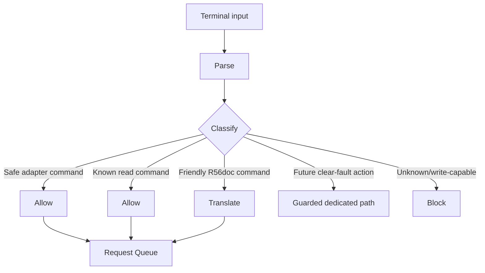

---

## 11. Vehicle identification

After the adapter is verified, R56doc should interrogate the car.

Target fields:

```text
VIN
R56 model/variant
engine family
transmission
build information where actually available
```

No field should be guessed.

Suggested object:

```js
{
    vin: "...",
    model: "MINI Cooper S",
    chassis: "R56",
    engine: "N14",
    transmission: "Manual",
    buildDate: null
}
```

Exact requests need to be captured/verified before implementation.

---

## 12. ECU discovery

Not every R56 necessarily has exactly the same ECU set because equipment differs by engine, fuel type, transmission, options and production revision.

R56doc should eventually maintain a candidate ECU registry and safely probe for responding modules.

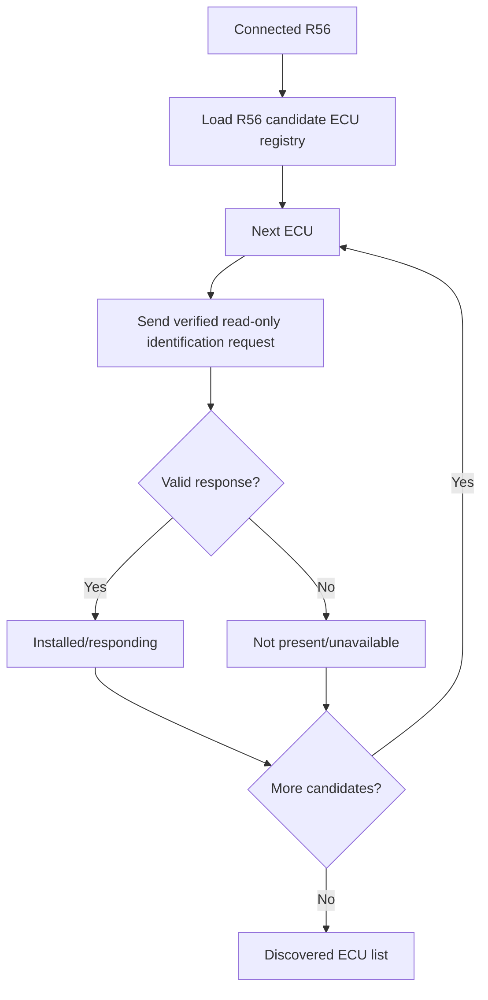

Fault scanning and live-data definitions should use the discovered modules.

---

## 13. Fault scanning

Keep the verified read flow:

```text
18 02 FF FF
```

then for each returned fault:

```text
17 XX XX
```

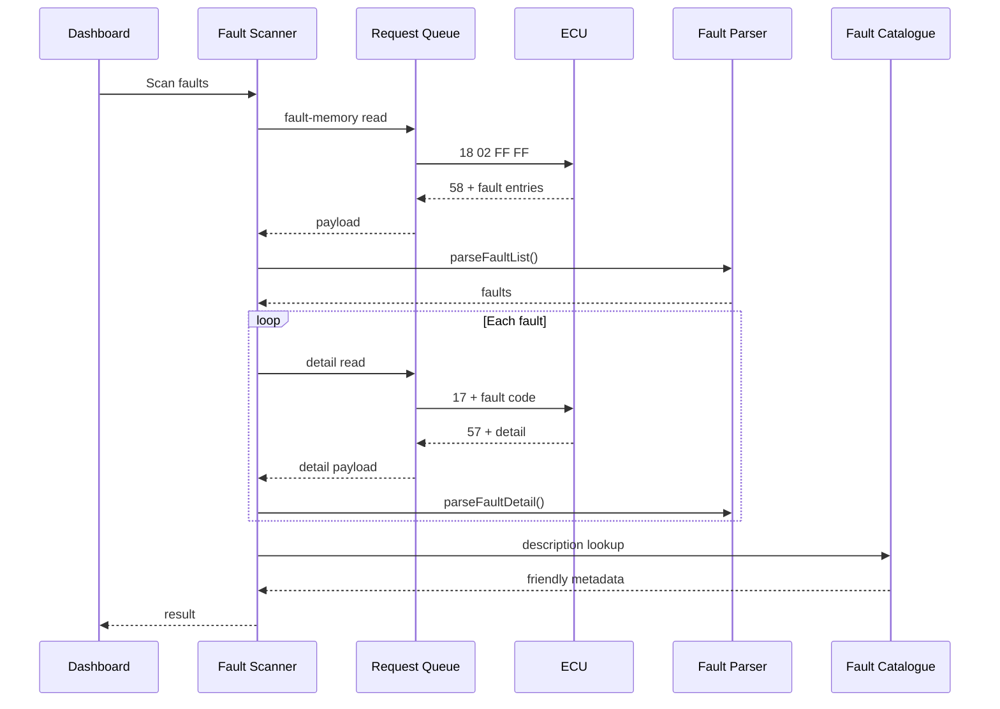

---

## 14. Fault catalogue

Use a local curated database.

Suggested structure:

```text
data/faults/
    dme.json
    dsc.json
    cas.json
    frm.json
    kombi.json
    ...
```

Example:

```json
{
  "module": "DSC",
  "code": "XXXX",
  "title": "Wheel-speed signal fault",
  "description": "The stability-control module detected an implausible wheel-speed signal.",
  "severity": "warning",
  "likelyCauses": [
    "Wheel-speed sensor",
    "Sensor wiring or connector"
  ],
  "verified": true
}
```

Only source-backed descriptions should be used.

Unknown-code fallback:

```text
DSC fault XXXX

R56doc does not yet have a verified description for this fault.
```

---

## 15. Fault status

Eventually show:

```text
CURRENT
HISTORIC
UNKNOWN
```

instead of raw values such as `0x64`.

Add:

```text
js/r56/faults/fault-status.js
```

Do not decode status bits until their semantics have been verified for the relevant module/ECU family.

---

## 16. Fault timing

Distinguish:

### Scan timestamp

Always available:

```text
Scanned by R56doc at 18:22
```

### ECU occurrence time

Only display it when a verified ECU field actually supplies it.

Do not invent dates from unknown environmental bytes.

---

## 17. Live-data architecture

Add:

```text
js/r56/live/
    live-data-controller.js
    live-data-poller.js
    live-data-definitions.js
    live-data-parsers.js
```

Each signal should be data-driven.

Example:

```js
{
    id: "engine.rpm",
    category: "engine",
    label: "Engine RPM",
    module: "DME",
    request: [...],
    parser: "parseEngineRpm",
    unit: "rpm",
    refreshMs: 750,
    display: {
        type: "gauge",
        min: 0,
        max: 8000
    }
}
```

---

## 18. Live-data flow

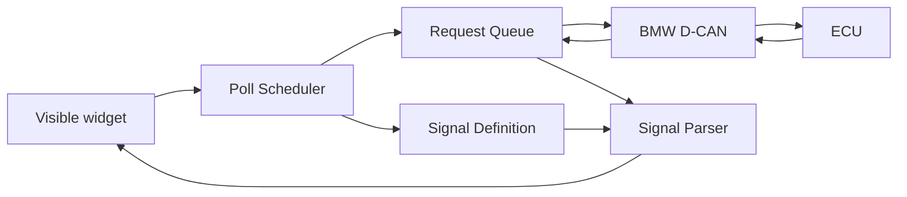

Target roughly 1-2 visible updates per second.

Rules:

- poll only values currently needed;
- group values into one ECU request where possible;
- one request at a time;
- pause polling during terminal commands, fault scans, identification and discovery;
- resume automatically.

---

## 19. Live UI by category

### Engine

- RPM
- coolant temperature
- intake temperature
- oil temperature
- boost/MAP
- throttle
- accelerator position
- ignition timing
- fuel pressure
- lambda/O2
- fuel trims
- fan state
- diesel DPF information where applicable

### Chassis

- four wheel speeds
- steering angle
- brake pressure
- yaw rate
- lateral acceleration
- longitudinal acceleration
- clutch
- gear
- vehicle speed

### Electrical

- battery/system voltage
- ignition state
- useful module/electrical states

Use different visual components depending on the signal:

| Signal | Display |
|---|---|
| RPM | gauge + numeric |
| speed | gauge + numeric |
| coolant/oil/intake temperature | temperature card |
| boost/MAP | gauge/bar |
| throttle/accelerator | percentage bar |
| battery | voltage/status card |
| fuel trims | signed percentage |
| wheel speeds | four matched values |
| steering angle | centred signed value |
| brake pressure | bar/value |
| yaw/acceleration | signed value |
| clutch/fan | state badge |
| gear | large state badge |
| DPF load | progress/percentage |

---

## 20. Terminal docking implementation

Recommended HTML structure:

```html
<section id="diagnosticCockpit">
    <aside id="terminalPanel"></aside>
    <section id="keyInfo"></section>
</section>

<section id="vehicleHealth"></section>
<section id="faultSection"></section>
<section id="engineSection"></section>
<section id="chassisSection"></section>
<section id="electricalSection"></section>
```

Use `IntersectionObserver` to toggle:

```text
normal
docked
expanded
```

on the same terminal element.

---

## 21. Error handling

Internally distinguish:

```text
SERIAL_ERROR
ADAPTER_ERROR
TRANSPORT_ERROR
MODULE_TIMEOUT
MODULE_NOT_PRESENT
SERVICE_UNSUPPORTED
PARSE_ERROR
UNKNOWN_VEHICLE_DATA
```

Keep user-facing wording simple:

```text
Adapter disconnected
Module not present or unavailable
This request is not supported
R56doc could not understand this response
```

Full technical detail goes into the terminal.

---

## 22. Future fault clearing

Do not expose arbitrary writes in the terminal.

If clearing is added later:

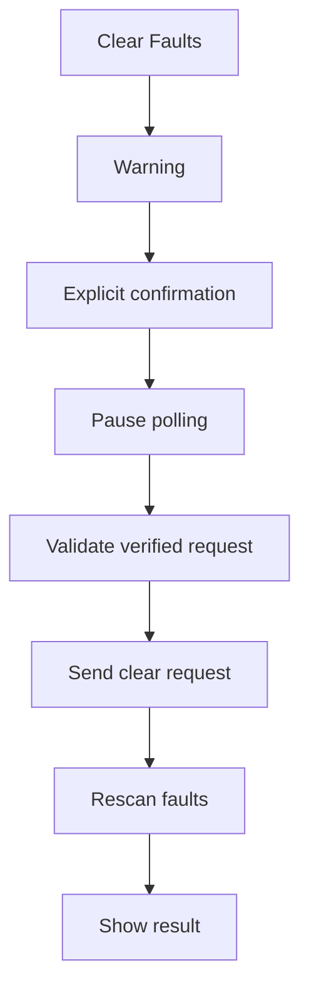

Keep it isolated:

```text
js/r56/write/clear-faults.js
```

No coding, adaptations or actuator tests.

---

# 23. Proposed final file structure

```text
/
├── index.html
├── cmd.html
│
├── css/
│   ├── style.css
│   └── cmd.css
│
├── js/
│   ├── setup.js
│   ├── cmd.js
│   ├── serial-connection.js
│   ├── elm327.js
│   ├── bmwDcan.js
│   ├── logger.js
│   ├── storage.js
│   │
│   ├── diagnostics/
│   │   ├── diagnostic-session.js
│   │   ├── request-queue.js
│   │   ├── command-policy.js
│   │   ├── diagnostic-events.js
│   │   └── error-types.js
│   │
│   └── r56/
│       ├── modules.js
│       ├── vehicle-identification.js
│       ├── ecu-discovery.js
│       │
│       ├── faults/
│       │   ├── fault-scanner.js
│       │   ├── fault-parser.js
│       │   ├── fault-status.js
│       │   └── fault-catalog.js
│       │
│       ├── live/
│       │   ├── live-data-controller.js
│       │   ├── live-data-poller.js
│       │   ├── live-data-definitions.js
│       │   └── live-data-parsers.js
│       │
│       └── write/
│           └── clear-faults.js
│
└── data/
    └── faults/
        ├── dme.json
        ├── dsc.json
        ├── cas.json
        └── ...
```

---

# 24. Development workplan

## Phase 0 — Serial reliability

**Goal:** Make adapter communication boringly reliable.

Tasks:

- deterministic Bluetooth serial-port selection;
- verify adapter with `ATI` on connection;
- verify repeated `ATI`;
- verify close/reopen;
- remove duplicate serial communication implementations;
- useful connection-state messages.

Acceptance:

```text
Connect
→ ATI succeeds
→ cmd.html opens
→ ATI succeeds repeatedly
→ reconnect/page reload works
```

Do not move deeper until this is stable.

---

## Phase 1 — Verify existing fault transport

**Goal:** Confirm the current scanner against the real car.

Tasks:

- keep offline trace regression tests;
- verify ISO-TP;
- verify response-pending handling;
- test existing ECU addresses;
- compare code output with Deep OBD;
- log raw TX/RX.

Acceptance:

```text
R56doc fault-code/module output
matches Deep OBD closely
under the same vehicle state
```

---

## Phase 2 — RequestQueue

Create:

```text
js/diagnostics/request-queue.js
```

Tasks:

- one active request at a time;
- priority queue;
- pause/resume live polling;
- timeout propagation;
- cancellation/shutdown path.

Acceptance:

Terminal and fault scan can share one page without serial-lock collisions.

---

## Phase 3 — DiagnosticSession

Create:

```text
js/diagnostics/diagnostic-session.js
```

Tasks:

- move ELM/BMW transport ownership into the session;
- route all requests through the queue;
- expose high-level methods;
- keep existing scanner working through it.

---

## Phase 4 — Diagnostic events

Create:

```text
js/diagnostics/diagnostic-events.js
```

Emit:

```text
TX
RX
scan started
scan complete
fault found
live value
connection error
```

Consumers:

```text
terminal
dashboard
logger
```

Acceptance:

One fault scan produces both raw terminal history and friendly dashboard results without duplicate requests.

---

## Phase 5 — Merge faults into `cmd.html`

Tasks:

- add Scan Faults button;
- show raw scan history in terminal;
- show friendly fault summary on right;
- leave `faults.html` as a development page only;
- use existing scanner logic rather than copying it.

---

## Phase 6 — Build polished cockpit

Tasks:

- 50/50 initial layout;
- connection widget;
- vehicle widget placeholder;
- fault health widget;
- quick live-data placeholders;
- proper loading/unavailable states;
- responsive desktop/mobile layout.

Do not fill unavailable data with fake placeholders that look real.

---

## Phase 7 — Terminal dock animation

Tasks:

- one terminal DOM element;
- `IntersectionObserver`;
- normal/docked/expanded states;
- preserved history;
- responsive fallback.

Acceptance:

```text
scroll down
→ terminal docks
→ content expands
→ terminal can reopen
→ history remains intact
```

---

## Phase 8 — Fault descriptions

Tasks:

- select authoritative/public sources;
- define catalogue schema;
- create module JSON files;
- add catalogue loader;
- store provenance;
- add unknown-code fallback.

Prioritise:

```text
DME
DSC
CAS
KOMBI
FRM
```

---

## Phase 9 — Fault status

Tasks:

- research/verify raw status semantics;
- create module-aware decoder;
- add tests using known traces;
- retain raw byte internally.

Acceptance:

No current/historic label unless verified.

---

## Phase 10 — Live-data reverse engineering

Use Deep OBD traces to capture real requests and responses.

Priority signals:

```text
RPM
coolant
battery
vehicle speed
four wheel speeds
boost/MAP
throttle
steering angle
brake pressure
```

For every signal record:

```text
module
request
response example
conversion
unit
expected range
```

---

## Phase 11 — Live-data engine

Create:

```text
js/r56/live/
    live-data-definitions.js
    live-data-parsers.js
    live-data-poller.js
    live-data-controller.js
```

Tasks:

- signal definitions;
- verified parsers;
- 1-2 Hz scheduler;
- RequestQueue integration;
- pause/resume;
- visible-widget polling only.

Acceptance:

Several signals run for at least 10 minutes with no stream locks, response mix-ups or queue deadlocks.

---

## Phase 12 — Engine UI

First:

```text
RPM
coolant
MAP/boost
throttle
accelerator
intake temperature
```

Then:

```text
fuel pressure
lambda/O2
fuel trims
oil temperature
ignition timing
fan
DPF values
```

---

## Phase 13 — Chassis UI

Add:

```text
FL/FR/RL/RR wheel speeds
steering angle
brake pressure
yaw
lateral acceleration
longitudinal acceleration
clutch
gear
vehicle speed
```

Display all four wheel speeds together.

---

## Phase 14 — Electrical UI

Add only genuinely useful information:

```text
battery/system voltage
ignition/key state
useful electrical/module state data
```

Avoid clutter merely because a value exists.

---

## Phase 15 — Vehicle identification

Capture and verify:

```text
VIN
model/variant
engine
transmission
build information where available
```

Add:

```text
js/r56/vehicle-identification.js
```

No guessed fields.

---

## Phase 16 — ECU discovery

Tasks:

- complete R56 candidate ECU registry;
- safe identification probe per module;
- mark installed/unavailable;
- scan only relevant modules;
- select correct live-data definitions by ECU variant.

Test across:

```text
petrol/diesel
manual/automatic
different production years
different options
```

---

## Phase 17 — Public-release polish

Reliability:

- Bluetooth loss;
- reconnect;
- timeouts;
- stalled ECU;
- malformed response;
- unsupported module;
- request cancellation.

UI:

- loading states;
- empty states;
- fault-card design;
- responsive layout;
- accessibility;
- unit consistency;
- dock polish.

Safety:

- terminal command policy;
- read-only fault whitelist;
- no arbitrary write path.

---

## Phase 18 — Optional fault clearing

Only after the read-only product is mature.

Tasks:

- verify exact clear request;
- dedicated button;
- explicit confirmation;
- pause polling;
- clear;
- rescan immediately;
- log action.

---

# 25. Immediate next tasks

Do these next, in this order:

```text
1. Fix serial / ATI reliability
2. Confirm real-car fault scanning
3. Build RequestQueue
4. Build DiagnosticSession
5. Add Diagnostic Event Bus
6. Merge Scan Faults into cmd.html
7. Build 50/50 cockpit
8. Build terminal docking animation
9. Add first fault descriptions
10. Decode fault status
11. Start live-data trace research
```

Do not build live-data polling before the shared request queue/session exists.

---

# 26. Dependency map

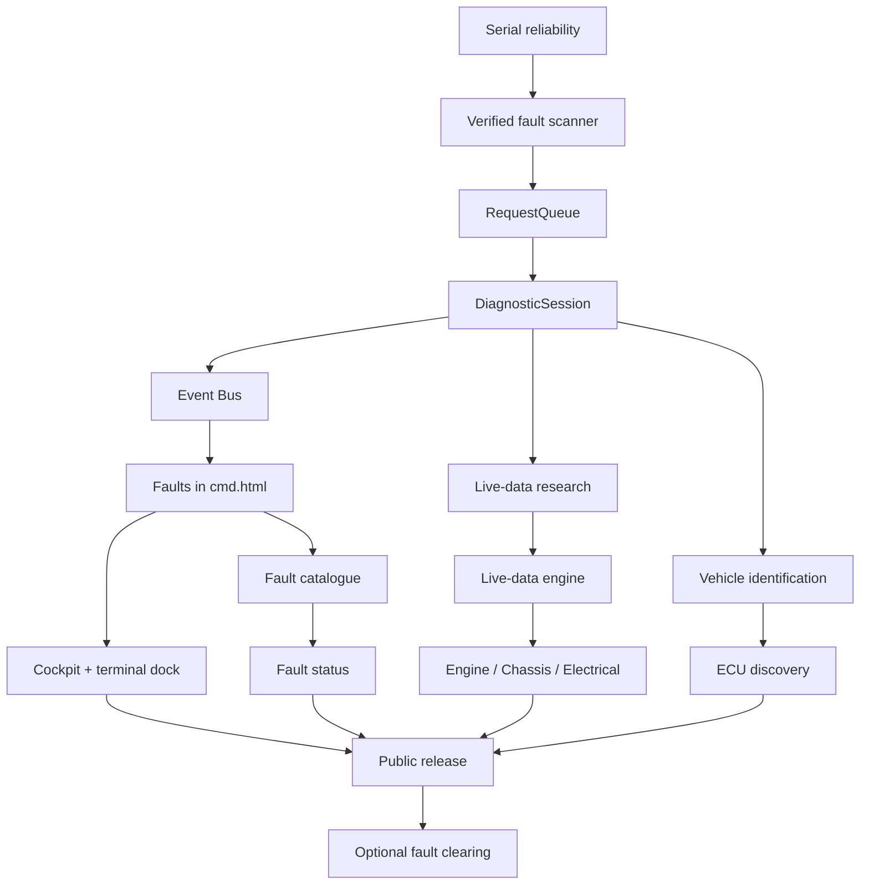

---

# 27. Testing strategy

Every new diagnostic capability should pass three levels.

### Level 1 — Offline

Use captured Deep OBD traces.

Test:

```text
CAN parsing
ISO-TP
fault parsing
status decoding
live-data conversion
```

### Level 2 — Controlled car test

```text
stationary vehicle
ignition on
engine off where possible
one ECU/request first
compare with Deep OBD
```

### Level 3 — Normal live test

Only once Level 2 is correct.

Examples:

```text
engine running for RPM/coolant
slow movement for wheel speeds
steering input for steering angle
```

---

# 28. Milestones

## v0.1

```text
stable adapter connection
terminal
BMW fault scanning
raw codes
```

## v0.2

```text
combined cmd dashboard
plain-English fault descriptions
fault status
terminal dock
```

## v0.3

```text
live Engine / Chassis / Electrical data
1-2 Hz polling
```

## v0.4

```text
vehicle identification
ECU discovery
variant-aware definitions
```

## v0.9 Public beta

```text
polished UX
reconnect/error handling
cross-R56 testing
safe terminal policy
```

## v1.0

```text
Connect
→ identify R56
→ terminal + dashboard
→ scan installed ECUs
→ understand faults
→ current/historic state
→ integrated live data
→ safe technical terminal
```

---

# 29. Definition of done

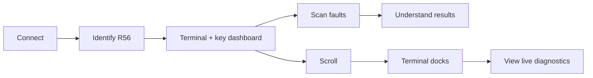

R56doc 1.0 succeeds when a normal MINI R56 enthusiast can use the site without understanding:

```text
EDIABAS
SGBD files
CAN IDs
ISO-TP
BMW service bytes
fault-status bit masks
```

while the terminal still lets interested users see exactly what R56doc is doing underneath.
